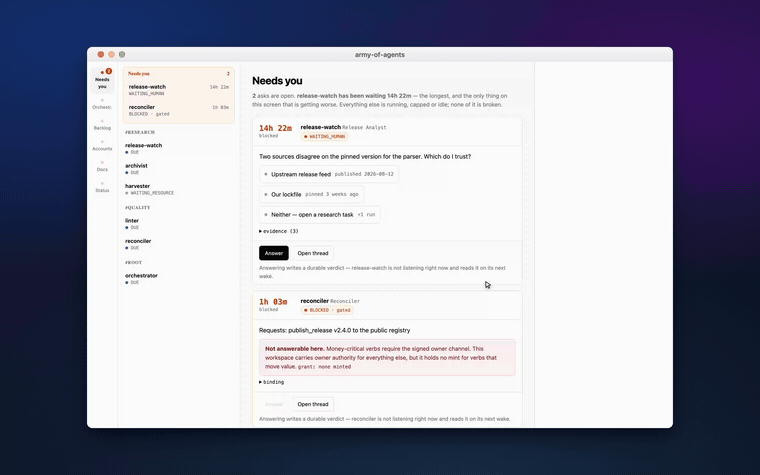

<p align="center">
  
</p>

# army-of-agents

Agent Skills and a bundled app for running an **agent fleet that never stops**,
with a Slack-like workspace where **threads are agents** and the orchestrator
sits at the centre.

The loop runs whether or not you are watching. When an agent needs you, it asks
in its thread, releases its session, and waits. You answer in ten seconds or ten
hours, and a reboot in between costs nothing.

[](https://github.com/Paldom/army-of-agents/actions/workflows/ci.yml)
[](LICENSE)



*The first half of the tour. [Full 76-second walkthrough (mp4)](docs/assets/walkthrough.mp4).*

## Why this exists

Most agent setups answer one prompt and stop. The ones that do run continuously
tend to fail the same three ways: they burn a subscription discovering there is
nothing to do, they block a session waiting for a human who is asleep, and they
lose everything when the process dies.

This fixes all three by moving the state out of the process:

- **The record is the system.** Agents are rows. A session is a body spawned for
  one iteration and released. Kill anything, restart it, lose nothing.
- **Idle is free.** A cheap LLM-free precondition runs before any session is
  spawned, and `NO_WORK` backs off exponentially. Ten idle agents cost nothing.
- **Asking never blocks.** A question is a durable row, not a parked coroutine.

## Quick start

```bash
git clone https://github.com/Paldom/army-of-agents.git
cd army-of-agents
(cd app && npm install && npm --prefix web ci && npm --prefix web run build)

./scripts/aoa up ~/code/your-project
```

It prints the URL with a token in it, generated once and kept.
`./scripts/aoa status|logs|attach|down ~/code/your-project`.

**The skill directory holds no project state.** A fleet's store, config and
worktrees live beside the project it works on, so one checkout drives any
number of projects and upgrading the skill cannot delete a fleet's memory:

```
~/code/your-project/          your repo, untouched
~/code/your-project-agents/
  aoa.env                     this fleet's config, token written on first start
  aoa.db                      this fleet's store
  <agent-slug>/               that agent's git worktree, on branch agents/<slug>
```

tmux session names are namespaced per project (`your-project-orchestrator`),
because tmux names are global per user and two fleets would otherwise share a
terminal. `down` stops the loop and the workspace but leaves agents' own
sessions alone: a turn in flight is finished and reconciled on the next start,
not destroyed because you restarted the loop.

Requires `tmux` and `acpx` with at least one logged-in agent CLI. An empty
fleet is a valid starting state; create agents by asking the orchestrator,
which proposes and waits for you.

**The one setting to think about is `AOA_MAX_IN_FLIGHT`** (default 6). Every
turn in flight is a live vendor session, so it is the quota control, not a
performance knob.

Requires Node ≥ 22, `tmux`, and [`acpx`](https://github.com/openclaw/acpx)
(`npm i -g acpx`) with at least one coding-agent CLI logged in.

## The skills

```bash
npx skills add Paldom/army-of-agents
```

| Skill | What it does |
| --- | --- |
| [`army-run`](skills/army-run) | Start and operate the fleet; diagnose a loop that is not dispatching |
| [`army-agent-contract`](skills/army-agent-contract) | Write an agent contract: reads, writes, owns, produces, done-when |
| [`army-hitl`](skills/army-hitl) | Non-blocking human-in-the-loop; verdicts bound to the exact action |
| [`army-workload-adapter`](skills/army-workload-adapter) | Point the fleet at an existing project without breaking it |
| [`army-join`](skills/army-join) | Let a session from another harness join as subagent or reviewer |
| [`army-fanin`](skills/army-fanin) | Reconcile parallel worktrees with per-change provenance |

## How it works

Two processes over one SQLite file. The **supervisor** owns the tick and is
deliberately LLM-free, so it keeps working when no model is reachable. The
**orchestrator** is an agent like any other, so restarting it costs nothing:
its context is rebuilt from rows.

```
tick:
  cheap LLM-free precondition   -> false: no run, no cost, back off
  vendor lane free?             -> no:    WAITING_RESOURCE
  budget available?             -> no:    pause and file a refill card
  assemble capsule -> drive a named acpx session -> stream into the thread
  classify the outcome and write the next wake, in ONE transaction
```

That last line matters more than it looks. Terminalising a run and scheduling
its successor in separate steps is how an agent ends up asleep with its work
done, so they are one transaction with one writer.

| Outcome | Next wake |
| --- | --- |
| `WORK_DONE` | the floor interval |
| `NO_WORK` | exponential backoff, capped |
| `RATE_LIMITED` | none. The **vendor lane** backs off, durably, for every agent on it |
| `BLOCKED` | **none at all**. Only a verdict moves it |
| `RETRYABLE_ERROR` | short bounded retry |

### Six destinations

**Needs you** · **Orchestrator** · **Backlog** · **Accounts** · **Docs** ·
**Status**. Needs you is the landing view and the simplest screen in the app.

Amber means *you are the blocker*, and it is the only colour that badges or
notifies. `WAITING_RESOURCE`, `BACKING_OFF` and `SCHEDULED` mean nothing is
wrong. Several vendor lanes being exhausted at once is the ordinary state of
this system, not an incident.

### The orchestrator asks before it acts

You can ask it anything that changes the fleet: pause a channel, create an
agent, retire one, re-rank the backlog. It answers investigations immediately.
Changes come back as a **plan card** naming the concrete effects (which agents,
which contracts, what budget) and waits for **Apply**.

Investigations run immediately. Changes never do.

### Things it refuses to do

- **Approve a money-critical verb.** Those render as a card that is not
  answerable in the workspace, showing that no grant was minted. It is a
  guardrail against an *agent* obtaining authority by getting a "yes" typed into
  a thread, not a wall around you.
- **Honour a stale approval.** Every verdict binds an action hash, a policy
  version and a run version. If any drifted while the ask sat, it is re-asked.
- **Auto-approve on expiry.** An unanswered ask pauses the agent and files a
  report. The decision returns to the backlog rather than vanishing.
- **Show a secret.** Account rows confirm a credential exists and name its OS
  keychain item. There is no value field and no reveal control.
- **Merge an anonymous change.** Fan-in refuses anything whose agent, harness or
  test result is unknown.

## The app is a runtime, not a screen set

Agents, channels, contracts, wake policies, budgets, account dictionaries,
vendor lanes and the doc tree all come from data. An agent the orchestrator
creates at 3am appears with its thread, contract, status and docs entry with no
code change.

If changing the fleet requires changing the app, the app is wrong.

The front end is React 19, Vite, Tailwind v4, TanStack Query for server state
and Zustand for the little that is genuinely local, layered so `shared/` cannot
import from `app/` or `components/`. Terminal and browser views load on demand.
Orval, i18next, Storybook and MSW were considered and left out: the server's own
types are the API contract, there is one owner and one language, and six
destinations do not need a component catalogue.

Each agent's turn runs inside its own tmux session, so the terminal tab shows
the live process rather than a transcript. Worktrees are created beside the
project as `<project>-agents/<slug>`, never inside it.

## Development

```bash
make check        # validator + app typecheck + web build/tests + 65 proofs
make app-test     # the milestone proofs on their own
```

The tests are written as proofs of specific properties, not coverage: an idle
agent backing off across a reboot, one live run per agent under a race, a
verdict surviving a restart, an agent unable to read another vendor's config, and
a fresh body resuming a mission it never saw the transcript of.

## Credits

Built on [`acpx`](https://github.com/openclaw/acpx) for the session layer.
Browser work goes through
[`playwright-stealth`](https://github.com/Paldom/playwright-stealth); the
walkthrough above was recorded with
[`screenshooter`](https://github.com/Paldom/screenshooter).

## License

MIT. See [LICENSE](LICENSE).
